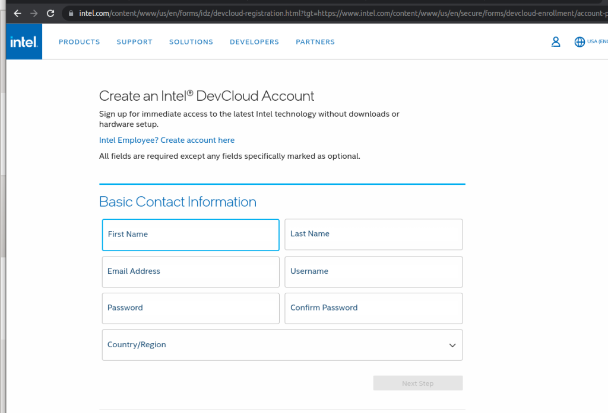
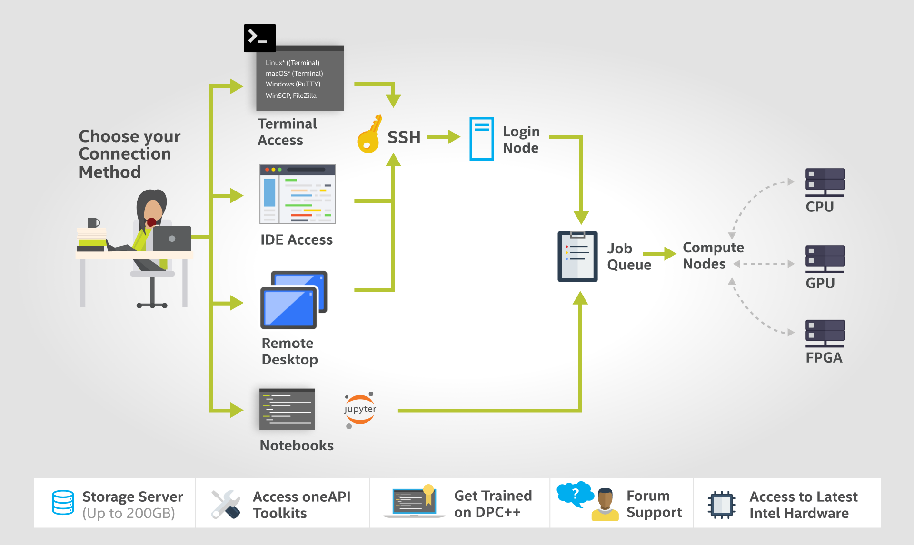
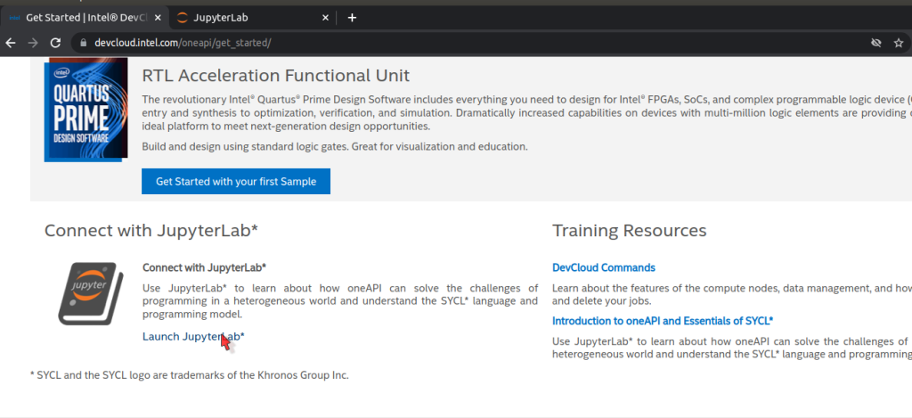
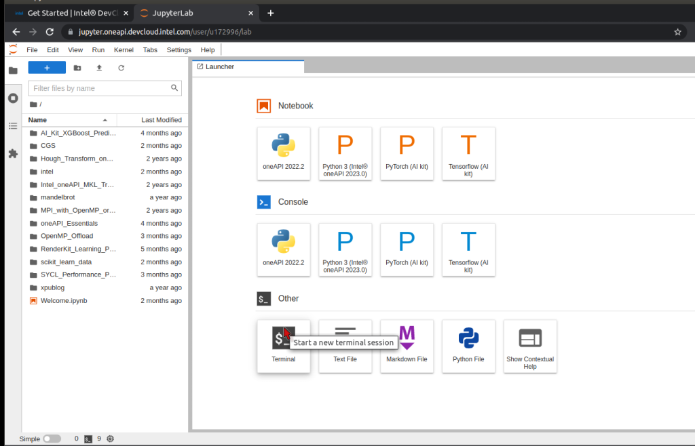

# oneAPI_ML_Jul23
## Contenidos
* En este repositorio se encuentran los códigos propuestos en el taller [oneAPI: Machine Learning con Python](https://www.danysoft.com/introduccion-a-python-y-aprendizaje-automatico-con-la-suite-oneapi/)
* Para poner a punto el taller se recomienda seguir los pasos de la sección [Setup del lab](#setup-del-lab)
* Los códigos que vamos a trabajar están disponibles en la [sección "Ejemplos"](#ejemplos), resumidamente trabajan algunos de los aspectos mostrados en la parte teórica:
    * Cuadernos Jupyter y acceso al Intel DevCloud
    * Uso eficiente de pandas
    * Aceleración con numpy
    * ML con Intel Intel Extension para Scikit-learn 
    * Uso de CPU y GPU para ML


# Setup del lab

## Transparencias
* Todo el material está disponible en el repositorio [github](https://github.com/garsanca/oneAPI_ML_Jul23)
    * Puede descargarse fácilmente clonando el repositorio ejecutando en un terminal el comando ```git clone https://github.com/garsanca/oneAPI_ML_Jul23```
* Además las transparencias del taller están disponible en el [directorio "transparencias"](transparencias/taller_oneAPI-ML_Jul23.pdf) 

## Cuenta en DevCloud
* El [Intel® DevCloud for oneAPI](https://devcloud.intel.com/oneapi/) es un espacio de desarrollo **gratuito** para que la comunidad de desarrolladores puedan programar aplicaciones. Instrucciones para [solicitud de cuenta](transparencias/DevCloud_Setup_New_Users.pdf)
    * Múltiples **hw**: 
        * **CPUs**: desktop *i9-11900* y servidor tipo Xeon diferentes arquitecturas (Skylake,  Ice Lake, Sapphire Rapids)
        * **GPUs**: integradas UHD Intel® Core™ Gen9 y Gen11 
        * **FPGAs**: Arria 10 y Stratix 10
    * **sw**: oneAPI divididos en [Toolkits](https://www.intel.com/content/www/us/en/developer/tools/oneapi/toolkits.html#gs.pd8yyt)
        * Compiladores: C/C++ y Fortran
        * Herramientas de perfilado: VTune, Advisor, GDB
        * Librerías optimizadas: oneMKL, oneDPL, oneVPL, oneDNN...
* Solicitud de cuenta gratuita [rellenando formulario](https://www.intel.com/content/www/us/en/forms/idz/devcloud-registration.html?tgt=https://www.intel.com/content/www/us/en/secure/forms/devcloud-enrollment/account-provisioning.html)
    * o bien en la web del [Intel® DevCloud for oneAPI](https://devcloud.intel.com/oneapi/) en la opción **Enroll**
    * **Importante** usar correo de UCM porque tiene una duración de uso mayor
    * Se recibirá un correo electrónico con instrucciones de uso



## Conexión a DevCloud
* Existen varios mecanismos de [conexión al Intel DevCloud](https://devcloud.intel.com/oneapi/documentation/connect-with-ssh-linux-macos/)



* La más sencilla es abrir un cuaderno de Jupyter
    1. Una vez logeado en la web del [Intel® DevCloud for oneAPI](https://devcloud.intel.com/oneapi/) en la opción **Sign In** (esquina superior derecha)
    2. Ir a la opción **"Get Started"** en la banda superior azul
    3. Clicar sobre **"Launch JupyterLab"** en la parte inferior izquierda o en el [atajo](https://jupyter.oneapi.devcloud.intel.com/hub/login?next=/lab/tree/Welcome.ipynb?reset)



## Entorno Jupyter
* El [Intel® DevCloud for oneAPI] contiene un entorno JupyterLab



* En la parte de la izquierda tiene un navegador de ficheros del usuario
    * Como funcionalidad útil, se pueden arrastrar fichero del equipo del *host* y automáticamente se llevan al DevCloud sin necesidad de hacer un sftp
* En la parte de la derecha contiene las principales aplicaciones disponibles:
    * **Notebook o cuaderno de Jupyter** que usaremos en el taller para ilustrar el funcionamiento del "Data Parallel C++"
    * **Consola** o terminal para interactuar con el sistema

## Cuadernos de Jupyter
* Los cuadernos de Jupyter o **Notebook** están estructurados en cajas denominadas **celdas**
    * Pueden contener celdas de texto (explicativo)
    * También celdas de código C++ o python que se ejecutan de forma interactiva pulsando el botón **▶** o con el "atajo" *Shifth+Enter*
    * En el navegador de fichero, el cuaderno "oneAPI_Essentials/00_Introduction_to_Jupyter/Introduction_to_Jupyter.ipynb" contiene más información y un vídeo explicativo del funcionamiento
        * También es accesible en el [enlace](https://jupyter.oneapi.devcloud.intel.com/hub/login?next=/lab/tree/oneAPI_Essentials/00_Introduction_to_Jupyter/Introduction_to_Jupyter.ipynb?reset)

## Ejecución en terminal (sistema colas)
* El [Intel® DevCloud for oneAPI](https://devcloud.intel.com/oneapi/) dispone de un sistema de colas para poder ejecutar las tareas
* El lanzamiento de trabajo se realiza mediante [jobs](https://devcloud.intel.com/oneapi/documentation/job-submission/)
* Existen dos formas de utilizar un nodo GPU: interactivo o trabajo tipo batch
    * Para solicitar una sesión de forma interactiva con el comando qsub ```qsub -I -l nodes=1:gpu:ppn=2 -d .```
        * ```-l nodes=1:gpu:ppn=2``` asigna un nodo completo con GPU
        * ```-d``` indica que la sesión abierta en el nodo se realiza en el mismo directorio que el lanzamiento de qsub
    * En un lanzamiento de tipo batch el trabajo se encola hasta que hay un slot disponible. La sintaxis es ```qsub -l nodes=1:gpu:ppn=2 -d . job.sh```
        * Donde el script job.sh contiene la secuencia de órdenes a lanzar

Un ejemplo del fichero job.sh sería el siguiente donde se muestra la hora de comienzo del job y su hora de finalización:
```bash
#!/bin/bash

echo
echo start: $(date "+%y%m%d.%H%M%S.%3N")
echo

# TODO list

echo
echo stop:  $(date "+%y%m%d.%H%M%S.%3N")
echo
```

* Para conocer las colas disponibles en el Intel DevCloud se puede utilizar el comando **pbsnodes**. Con el siguiente comando se conocen las propiedades de los nodos existentes ``` pbsnodes | sort | grep properties```

* Para más información relacionada con el lanzamiento de trabajos en el DevCloud se puede consultar la [documentación](https://devcloud.intel.com/oneapi/documentation/job-submission/)

# Ejemplos

## Cuadernos Jupyter y acceso al Intel DevCloud
1. En este [ejemplo](..) vamos 
